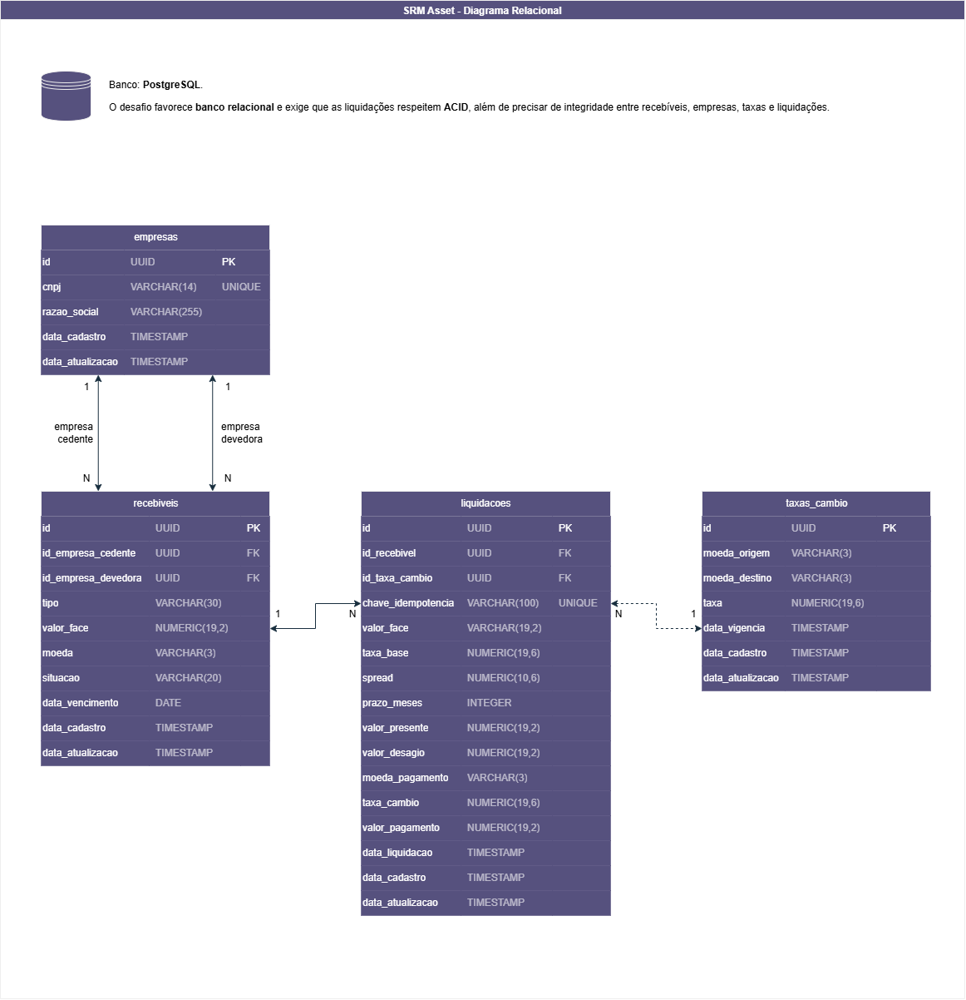

# SPEC — SRM Credit Engine

## 1. Objetivo

O SRM Credit Engine permite cadastrar empresas, recebíveis e taxas de câmbio, simular a precificação de recebíveis e registrar liquidações em BRL ou USD.

A solução utiliza backend em Java 21 com Spring Boot, Spring Data JPA, PostgreSQL, Flyway, JUnit, Mockito e frontend em React, Next.js, TypeScript e Tailwind CSS.

---

## 2. Premissas adotadas

- Os recebíveis são cadastrados em **BRL**.
- O pagamento pode ser realizado em **BRL ou USD**.
- A taxa base utilizada na precificação é de **1% ao mês**.
- O prazo é calculado em **meses inteiros** entre a data de referência e o vencimento.
- Fórmula: `Valor Presente = Valor de Face / (1 + Taxa Base + Spread)^Prazo`.
- Duplicata Mercantil: spread de **1,5% a.m.**
- Cheque Pré-datado: spread de **2,5% a.m.**
- Para pagamento em USD, é utilizada a taxa **USD → BRL** vigente na data da operação.
- A taxa vigente é a mais recente com `data_vigencia` menor ou igual à data da operação.
- A conversão para USD ocorre após o cálculo e arredondamento do valor presente em BRL.
- O recebível inicia como **PENDENTE** e, após a liquidação, passa para **LIQUIDADO**.
- A liquidação registra os valores usados no cálculo para preservar o histórico.
- A chave de idempotência impede que a mesma requisição gere duas liquidações.

---

## 3. Precisão numérica

- **Java:** `BigDecimal`
- **PostgreSQL:** `NUMERIC`
- **Arredondamento:** `RoundingMode.HALF_EVEN`
- **Valores monetários finais:** 2 casas decimais

---

## 4. Regras principais

### Precificação

O spread é definido pelo tipo do recebível usando o padrão Strategy.

`Deságio = Valor de Face - Valor Presente`

### Câmbio

Pagamento em BRL não utiliza conversão.

Pagamento em USD:

`Valor em USD = Valor Presente em BRL / Taxa USD-BRL`

A taxa utilizada fica registrada na liquidação.

### Liquidação

A liquidação deve:

- ocorrer dentro de uma transação;
- registrar os valores da precificação;
- registrar a taxa de câmbio quando aplicável;
- alterar o recebível para `LIQUIDADO`;
- ser idempotente;
- preservar o registro da operação.

---

## 5. Modelo de dados

O banco PostgreSQL possui quatro entidades principais:

- `empresas`
- `recebiveis`
- `taxas_cambio`
- `liquidacoes`

Relacionamentos principais:

- uma empresa pode participar de vários recebíveis como cedente;
- uma empresa pode participar de vários recebíveis como devedora;
- um recebível pode gerar uma liquidação;
- uma liquidação pode referenciar uma taxa de câmbio quando houver pagamento em USD.

### Diagrama relacional

---

## 6. Perguntas para o negócio

- A taxa base de 1% é fixa ou configurável?
- Como tratar prazos com meses incompletos?
- Qual fuso horário deve ser considerado nas datas de vigência e liquidação?
- Uma liquidação pode ser cancelada ou estornada?
- Haverá outras moedas além de BRL e USD?
- Em produção, a taxa de câmbio será manual ou virá de provedor externo?

---

## 7. Critérios de aceite

### Usabilidade

- Cadastrar e consultar empresas, recebíveis e taxas de câmbio.
- Simular o valor líquido antes da criação do recebível.
- Exibir corretamente valores em BRL e USD.
- Não mostrar recebíveis liquidados na fila de pendentes.

### Segurança e integridade

- Rejeitar entradas inválidas.
- Não permitir CNPJ duplicado.
- Garantir liquidação transacional e idempotente.
- Utilizar precisão decimal em valores financeiros.
- Preservar os dados usados na liquidação.

### Desempenho

- Buscar a taxa vigente diretamente pelo par de moedas e data de vigência.
- Evitar carregamento desnecessário de dados.
- O CNPJ é definido como UNIQUE para evitar registros duplicados e criar um índice, tornando a busca por empresa mais eficiente, de O(n) para O(1).

---

## 8. Casos de aferição

| Caso | Tipo | Valor de face | Prazo | Pagamento | Resultado esperado |
|---|---|---:|---:|---|---:|
| C1 | Duplicata Mercantil | R$ 100.000,00 | 3 meses | BRL | R$ 92.859,94 |
| C2 | Cheque Pré-datado | R$ 25.000,00 | 2 meses | BRL | R$ 23.337,77 |
| C3 | Duplicata Mercantil | R$ 100.000,00 | 3 meses | USD | US$ 17.094,67 |

Os três casos devem ser cobertos por testes automatizados.
